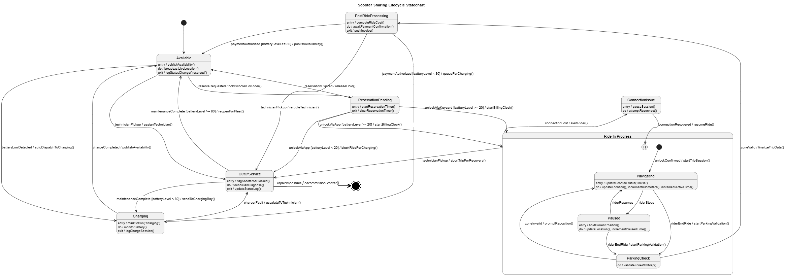
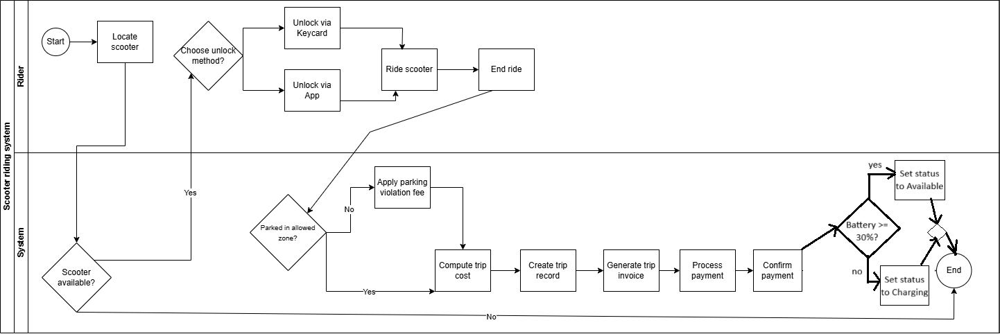
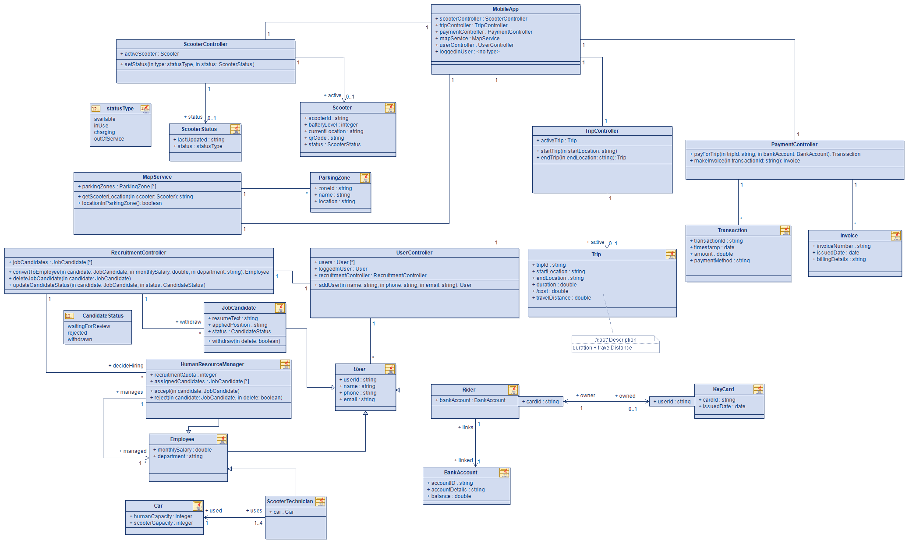

# SM 2025 Assignment 3

## Table of Contents

- [Task 1 - System Description](#task-1---system-description)
- [Task 2 - State Chart](#task-2---state-chart)
- [Task 3 - Activity Diagram](#task-3---activity-diagram)
- [Task 4 - Application Class Model](#task-4---application-class-model)
- [Task 5 - Generative AI assessment](#task-5---generative-ai-assessment)

## Task 1 - System Description

### Scooter Sharing System Description

Our system models a scooter sharing platform, similar to services like Bolt. The architecture is centrally managed by a MobileApp class, which serves as the entry point and aggregates specific controllers—ScooterController, TripController, PaymentController, MapService, and UserController—to orchestrate the interaction between users, the physical fleet, and the backend logic.
Scooter fleet and lifecycle.

#### Scooter fleet. 

Every Scooter is identified by scooterId and tracks its batteryLevel, currentLocation, qrCode, and the zoneId of the ParkingZone where it is parked. Each scooter owns exactly one ScooterStatus instance, capturing the last status change (lastUpdated) and the current status chosen from the statusType enumeration with its four literals (available, inUse, charging, outOfService).

The ScooterController manages the active fleet (via the activeScooter association and setStatus operation) and enforces a strict lifecycle defined by the system's State Chart:

    Available: The scooter performs broadcastLiveLocation(). From here, reserveRequested transitions it to ReservationPending (where startReservationTimer() runs), or batteryLowDetected auto-dispatches it to Charging.
    Ride In Progress: Upon a successful unlock (via unlockViaApp or unlockViaKeycard), the scooter enters this composite state. It cycles through internal states:
        Navigating: The main riding state where updateLocation() and incrementActiveTime() occur.
        Paused: Entered if the rider stops temporarily (holdCurrentPosition).
        ParkingCheck: Triggered by riderEndRide, where the system executes validateZoneWithMap() to ensure compliance.
        ConnectionIssue: Handles signal loss via attemptReconnect.
    PostRideProcessing: Once the ride ends validly, the system computes costs and awaits payment confirmation. If paymentAuthorized, the scooter returns to Available (if battery ≥ 30%) or transitions to Charging (if battery < 30%).
    Maintenance: Transitions like technicianPickup move the scooter to OutOfService for diagnosis, while maintenanceComplete returns it to service.

#### Trips and payments.

Riders start Trip instances, managed by the TripController (operations startTrip, endTrip). Each trip references exactly one scooter and one rider and is uniquely identified by tripId while storing startLocation, endLocation, duration, travelDistance, and a derived attribute /cost (calculated from duration + travelDistance).

The workflow follows a strict sequence detailed in the Activity Diagram:

    Locate & Unlock: The rider uses the app to locate a scooter. If available, they choose to unlock via App or Keycard.
    Ride: The rider operates the scooter.
    End & Validate: When ending the ride, the system checks if the scooter is "Parked in allowed zone?"
        If No, the Apply parking violation fee logic is triggered.
        If Yes, the flow proceeds to Compute trip cost.
    Financial Settlement: The process continues sequentially: Create trip record → Generate trip invoice → Process payment → Confirm payment → Update scooter status → End.

The PaymentController handles the financial backend (payForTrip, makeInvoice). It generates exactly one PaymentTransaction (transactionId, timestamp, amount, paymentMethod) and a one-to-one Invoice (invoiceNumber, issuedDate, billingDetails). Both artifacts correspond to a single Trip.

#### User hierarchy and Recruitment.

All people interact via the abstract User class (userId, name, phone, email), managed by the UserController (addUser, loggedInUser).

Riders:
Rider specializes User and owns exactly one BankAccount (accountId, accountDetails, balance) used to pay for trips. They may optionally link a physical KeyCard (cardId, issuedDate) for quick access.

HR and Recruitment:
The system includes a RecruitmentController to manage hiring logic.

    JobCandidates: Applicants are tracked as JobCandidate objects with resumeText, appliedPosition, and a status (from the CandidateStatus enum: waitingForReview, rejected, withdrawn). Candidates can perform the withdraw() operation.
    Recruitment Process: The controller provides operations to convertToEmployee(candidate), deleteJobCandidate(candidate), and updateCandidateStatus.
    Employees: Once hired, a candidate becomes an Employee (monthlySalary, department).
    Managers: A HumanResourceManager is a specialized Employee who manages other employees. They have a recruitmentQuota and operations to accept(candidate) or reject(candidate).

#### Operations staff.

ScooterTechnician (specializing Employee) uses the ScooterController to perform maintenance (maintenanceComplete, technicianDiagnose). They are provided with exactly one Car (humanCapacity, scooterCapacity), which supports between one and four technicians (1..4 multiplicity). Technicians may maintain many scooters, while each scooter is assigned to at most one active technician at a time.
Physical infrastructure.

The MapService contains the defined ParkingZone instances (zoneId, name, location). It provides critical operations for the system's logic:

    getScooterLocation(scooter): Retrieves real-time coordinates.
    locationInParkingZone(): Returns a boolean used during the ParkingCheck state and the "Parked in allowed zone?" decision node in the activity workflow.

#### Process overview.

Riders discover a scooter via the MobileApp (backed by MapService), unlock it using the app or an optional key card, and complete a trip. On completion, the MapService validates the parking zone. If valid, the TripController finalizes the cost, and the PaymentController issues the transaction and invoice. Simultaneously, the ScooterController updates the scooter's state from PostRideProcessing back to Available or Charging. Technicians intervene when scooters enter OutOfService or Charging states, physically moving and diagnosing the fleet.

## Task 2 - State Chart

**History state description:** The history pseudostate stores the last active substate (Navigating, Paused, or ParkingCheck) within "Ride In Progress" before a connection loss occurs. This ensures that when the connection is recovered, the scooter returns to its previous substate rather than defaulting to the initial state, maintaining ride continuity and context.

## Task 3 - Activity Diagram

## Task 4 - Application Class Model

**Difference from the domain class model:** The application diagram adds the app/controller layer (MobileApp, Scooter/Trip/Payment/Recruitment controllers, MapService) that orchestrates domain entities and external services, while the domain class diagram focuses on core business objects (Scooter, Trip, Rider/Employee hierarchy, ParkingZone, BankAccount, etc.) and their real-world relationships. In short, the application model shows how the software components coordinate workflows; the domain model shows what the business concepts are.

## Task 5 - Generative AI assessment

### Generating State Chart

#### First Approach: Gemini 3 Pro (in Github Copilot Pro in agent mode)

I first decided to experiment with Gemini 3 Pro. I chose it because GitHub Copilot Pro is free for university students, so I don't need to create a new account for some site or enter billing information anywhere. Additionally, it's convenient to add files to the model's context and have it generate files directly in Visual Studio Code. I decided to try Gemini 3 Pro specifically because it's a relatively new model released by Google, and they claim it to be much better than 2.5 Pro (which from my personal prior experience was trash).

##### Prompts Used

###### Initial Prompt
1. "Create a state chart for the system described in sys_description.md file. Generate the statechart as plantuml code. Make sure you use composite states and history (where relevant) at least once. Note that the model should consist of at least at least 4 states, 7 events, guards, at least three types of actions/operations, composite states (at least once, where relevant), history pseudo-states (at least once, where relevant)."

*Note: "sys_description.md" file attached to the initial Gemini prompt contained our system description as Markdown text*

###### Follow-Up Prompts
2. "Fix the following error I got when compiling the code:
Error found in diagram ScooterStateChart
ERROR
6
Syntax Error?
Some diagram description contains errors"

3. "There are no operations defined in Paused and Charging states. only one transition as sequnece of actions defined, there should be more. Also one transition doesnt have event defined on it."

4. "It is currently not clear in the chart, what conditions lead the scooter from charging state to outofservice state. Improve that."

5. "This is better now, but technicianpickup event from available to outofservice state is also not understandable. Improve it as well."

6. "I think the transitions, which have event technicianpickup, should instead use the text given as guard for the event text instead (and get rid of technicianPickup entirely)."

##### Assessment

The model created a syntax error for the first prompt, which was problematic. However, it fixed the error after one follow-up prompt where I provided the PlantUML error message. The first diagram that compiled didn't look too bad, but some states missed operations, and some transitions were not clear. Overall, it was perhaps too simplistic compared to our diagram.

###### Successes
- Fixed syntax errors quickly when provided with specific error messages
- Generated a compilable PlantUML diagram on the second attempt
- Created a reasonable initial structure for the state chart
- Followed the basic requirements (composite states, history pseudo-states, multiple events, guards, actions)
- History pseudostate placement was quite reasonable and appearance was correct

###### Shortcomings
- Initial output contained syntax errors
- Some states missed operation definitions
- Transitions were unclear and lacked descriptive guards or conditions
- Diagram was too simplistic and could be improved with more detail
- Further refinement would require careful review and multiple iterations, which would be time-consuming to ensure new states and transitions fit properly with all necessary elements (operations, events, guards) defined
- Not suitable for improving existing statechart due to oversimplification; would have been more useful if applied during initial model creation rather than as a refinement tool

###### Conclusion

Good for generating an initial idea, but the output requires quite a bit of refinement to make it production-ready. The best approach to use this AI's generated model would be to create a new chat, provide the generated code as context along with the original system description, and explicitly request something similar but more detailed with clearly understandable transitions and all necessary elements (events, guards, operations) fully defined. For existing statechart, this approach would not be practical due to the oversimplification — it's better suited for starting fresh.

#### Second Approach: Claude Sonnet 4.5 (in Github Copilot Pro in agent mode)

As a second approach, I used Claude Sonnet 4.5. I chose it because GitHub Copilot Pro is free for university students, so I don't need to create a new account for some site or enter billing information anywhere. Additionally, it's convenient to add files to the model's context and have it generate files directly in Visual Studio Code. I decided to compare Gemini 3 Pro to Claude Sonnet 4.5 because it's a baseline good model for coding (based on my prior experience, it was orders of magnitude better than Gemini 2.5 Pro).

##### Prompts Used

###### Initial Prompt

1. "Create a state chart for the system described in sys_description.md file. Generate the statechart as plantuml code. Make sure you use composite states and history (where relevant) at least once.

Note that the model should consist of at least at least 4 states, 7 events, guards, at least three types of actions/operations, composite states (at least once, where relevant), history pseudo-states (at least once, where relevant)."

*Note: "sys_description.md" file attached to the initial Gemini prompt contained our system description as Markdown text*

###### Follow-Up Prompts

2. "This is too complex currently. Tone the complexity down (while still fulfilling the requirements). Also some of the states are missing operations. Also remove the comments inside the statechart: it should be understandable without comments."

3. "You only need one composite state. Almost all of your current composite states contain only one state, which is pointless."

4. "Got syntax error when compiling plantuml:
Error found in diagram Scooter_Sharing_System_Statechart
ERROR
7
Syntax Error?
Some diagram description contains errors"

5. "It's weird that scooter can go straight from available to decommissioned final state. It should first go to technician, if technician tells its unrepairable, then go to final state instead"

##### Assessment

The model managed to generate the statechart without syntax errors after the first prompt, which was a good start. However, it made the diagram way too complex and used many pointless composite states that contained only one state inside. It also added comments to the statechart, but the diagram should be understandable without them. The history state was also in the wrong place, and it would have taken more time to get it fixed because I would need to discuss and explain where and why it can and should be used (it seems Claude doesn't understand the history pseudostate as well as Gemini 3 Pro).

###### Successes

- Generated syntactically correct PlantUML code on the first attempt
- States and transitions had properly defined operations and events
- Helped improve the existing statechart model by providing ideas (e.g., decommissioned scooter final state)
- Better overall structure and detail compared to Gemini 3 Pro
- More suitable for creating initial statecharts

###### Shortcomings

- Initial output was overly complex with unnecessary composite states
- Many composite states contained only one state inside, which is pointless
- Added comments inside the statechart when it should be self-explanatory
- History pseudostate was placed incorrectly
- Would require additional effort to explain and fix the history state placement
- Understanding of history pseudostates appears weaker than Gemini 3 Pro

###### Conclusion

Overall, Claude Sonnet 4.5 performed better than Gemini 3 Pro, particularly in defining operations and events for states and transitions. A significant advantage is that it helped improve our existing statechart model by providing useful ideas like the decommissioned scooter final state. However, it still needs refinement, especially regarding the history state placement. Despite these issues, I would say it's better for creating an initial statechart compared to Gemini 3 Pro.

---

#### Overall Conclusion

Both models were good at generating initial statecharts that could be built upon. Claude Sonnet 4.5 provided a useful idea for improving our existing statechart (the decommissioned scooter final state), while Gemini 3 Pro did not help improve the current model due to its oversimplification. Overall, Claude Sonnet 4.5 still seems to be the better choice, although Gemini 3 Pro has caught up to the baseline Sonnet 4.5 model somewhat, offering comparable quality and even handling the history pseudostate better than Sonnet 4.5.

### Generating Activity Diagram

#### First Approach: Gemini 3 Pro

I first decided to experiment with Gemini 3 Pro. I chose it because it's a relatively new model released by Google and has been very well received, doing much better than its predecessor according to benchmarks and general user sentiment I've noticed. This should give the AI tool in question the best chance at matching or even improving our own diagram.

##### Prompts Used

###### Initial Prompt
1. "Create an activity diagram for the following system: <<Entered our system description from task 1 here>>. Generate the activity diagram as plantuml code. 

###### Follow-Up Prompts
2. "This version is a bit too technical, you are modelling activities so describe those activities instead of things like "execute method x""

3. "Consolidate all the system related swimlanes into one named "System" for clarity, currently there are multiple swimlanes with only two or three elements."

##### Assessment

The model did a fantastic job and reached an activity diagram very similar to our own by the end. Separating or consolidationg the swimlanes is a design decision more than anything else, so the only thing needing correction was telling Gemini to use natural language to describe actions.

###### Successes
- Generated a compilable and readable PlantUML diagram on the first attempt
- Created a reasonable initial structure for the activity diagram
- Perfectly handled consolidating swimlanes

###### Shortcomings
- Initial output was machine-like, referencing specific functions and classes rather than describing actual actions

###### Conclusion

Gemini 3 Pro understood the task immediately and made one small mistake before creating an activity diagram even a bit better than our own. I was able to improve our diagram with more specifics, for example including the condition for updating the scooter status to one option or another before the end.

#### Second Approach: Claude Sonnet 4.5 (in Github Copilot Pro in agent mode)

As a second approach, I used Claude Sonnet 4.5. I decided to compare Gemini 3 Pro to Claude Sonnet 4.5 because it's a baseline good model for coding (based on my prior experience, it was orders of magnitude better than the earlier Gemini 2.5 Pro).

##### Prompts Used

###### Initial Prompt

1. "Create an activity diagram for the following system: <<Entered our system description from task 1 here>>. Generate the activity diagram as plantuml code.

###### Follow-Up Prompts

2. "This version is a too technical, you are modelling activities so describe those activities instead of just writing method calls"

3. "This is much better but excessive, make no assumptions and only include steps from the description."

4. "Consolidate all the system related swimlanes into one named "System" for clarity, currently there are multiple swimlanes with only two or three elements."

##### Assessment

This model did a fine job, though it did initially add it's own assumed extra actions to the diagram which needed to be removed. 

###### Successes

- Generated syntactically correct PlantUML code on the first attempt
- Diagram included all the actions laid out in the given description
- Responses to follow-up prompts were as requested and without errors

###### Shortcomings

- Initial output was overly complex, laying out specific function calls and all the steps between controller steps rather than focusing on the actual actions performed by those functions
- The model assumed extra steps in the overall process (not mentioned in the description) and included them in the diagram despite no request to do so

###### Conclusion

Overall, Claude Sonnet 4.5 model's attempt went about the same as it did for Gemini 3 Pro, with an initial decent but overly technical (and in Sonnet's case bloated with extra functionalities) version, which was quickly improved upon to reach a similar and slightly improved diagram to our existing one. There wasn't really anything to add to our diagram that wasn't already present in Gemini 3 Pro's version.

---

#### Overall Conclusion

Both models were good at generating activity diagrams similar to our own with minimal further instruction. Gemini 3 Pro provided a useful idea for improving our existing activity diagram (specifying scooter status change and conditions for it), while Claude Sonnet 4.5 did the same and didn't change anything further. Overall, both models were great option for activity diagram generation (with PlantUML), with Gemini 3 Pro barely coming out ahead needing slightly less follow-up to reach the desired result.
